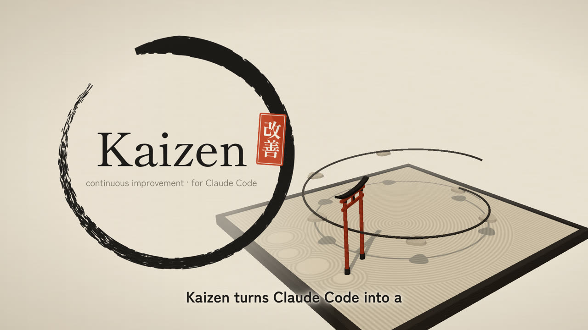

# Kaizen Plugin

**Un SDLC assisté par IA où chaque unité de travail rend la suivante plus facile.**

<a href="docs/media/kaizen-presentation.mp4"></a>

*Présentation en 80 secondes, avec voix off : [regarder la vidéo (MP4)](docs/media/kaizen-presentation.mp4)
· [sous-titres](docs/media/kaizen-presentation.srt). Source reproductible :
[docs/media/source/](docs/media/source/kaizen-presentation.html), rendue avec le plugin `motion-studio`.*

Kaizen structure le travail avec Claude Code de la constitution du projet jusqu'à la PR prête à
merger, puis **referme la boucle** : ce qui a été appris est écrit là où le prochain cycle le relira.

DORA 2025 (confirmé par son rapport ROI de 2026) montre que l'IA **amplifie**. Elle augmente le débit, mais aussi l'instabilité, sauf
pour les équipes qui gardent trois disciplines :
- des principes clairs ;
- de **petits lots** ;
- un vrai retour d'expérience.

Kaizen outille ces trois disciplines.

```
                     CONSTITUTION.md — principes non négociables, appliqués comme contrôles
 ideate → brainstorm → plan ─► doc-review → work → review → ship → watch-pr → learn
                        ▲                                                         │
                        └──────────── docs/learnings/ · docs/adr/ ◄───────────────┘
 debug → correctif → review → learn        polish : retouches UI guidées par l'utilisateur
 release → deploy → monitor ─(seuil franchi)→ rollback → postmortem → leçons · packs · amendements
 decide → ADR      metrics (DORA réel depuis les déploiements, coût des cycles)
 autopilot : de la demande à la PR prête, en autonomie      prune-learnings : entretien des leçons
 help : quelle commande lancer maintenant, d'après l'état du repo
```

> Inspiré très fortement du plugin [Compound Engineering](https://github.com/EveryInc/compound-engineering-plugin)
> d'Every (MIT) pour la boucle, les contrats d'artefacts, le schéma des leçons, les personas de revue
> et le suivi de PR.
> La **constitution** et ses contrôles viennent du
> [Spec Kit de GitHub](https://github.com/github/spec-kit). Les pratiques de livraison viennent de
> [DORA 2025](https://dora.dev/research/), du [NIST SSDF](https://csrc.nist.gov/projects/ssdf) et des
> [engineering practices de Google](https://google.github.io/eng-practices/).
> Kaizen est une version **uniquement pour Claude Code, en français**, intégrée aux plugins de ce
> marketplace (`git`, `security`, `playwright`). Elle ajoute un garde-fou par hook, un CLI
> déterministe sans dépendances, des tests et des évaluations de bout en bout. Voir [LICENSE](LICENSE).

## Documentation

- **[Démarrage](docs/demarrage.md)** — un premier cycle complet, pas à pas
- **[Guides par skill](docs/README.md)** — quand utiliser chaque commande, ce qu'elle produit, ses options
- [Configuration](docs/configuration.md) · [Kaizen Packs](docs/packs.md) · [Dépannage](docs/depannage.md) · [Changelog](CHANGELOG.md)

## Installation

```json
{ "enabledPlugins": { "kaizen@angelo-plugins": true } }
```

Prérequis : Node ≥ 18 et git ; `gh` pour les PR. Aucune dépendance npm. Dans un repo :

```
/kaizen:setup
/kaizen:constitution
```

## Les commandes (23 skills)

Perdu ? **`/kaizen:help`** explique Kaizen, regarde où en est votre repo et vous dit quelle commande
lancer ensuite.

### Cadrer

| Commande | Rôle |
|---|---|
| `/kaizen:constitution` | Crée, amende (`amend`) ou audite (`audit`) `CONSTITUTION.md` : 5 à 9 principes non négociables, **chacun avec un contrôle vérifiable**, et une politique IA (ce que les agents font seuls). Interview qui repousse les principes vagues, puis stress test. Versionnée (SemVer), gouvernée. |
| `/kaizen:ideate` | 5 angles en parallèle, chaque idée avec une base vérifiable, critique à froid, 5 à 7 survivantes classées. |
| `/kaizen:brainstorm` | Définit **QUOI** construire par un dialogue d'une question à la fois. Écrit les exigences (R1…) et les exemples d'acceptation (AE1…). Les zones floues sont marquées `[À CLARIFIER : …]` au lieu d'être devinées. |
| `/kaizen:decide` | Décision difficile ou irréversible : options comparées sur preuves, verdict avec niveau de confiance et signal de révision, puis **ADR** (`docs/adr/`). |

### Construire

| Commande | Rôle |
|---|---|
| `/kaizen:plan` | Décide **COMMENT** : recherche en parallèle, décisions justifiées (KTD). Le plan contient en plus : contrôle constitutionnel, **menaces (STRIDE)**, **déploiement et retour arrière**, unités groupées en **tranches de la taille d'une PR**. `plan check` déterministe, puis `doc-review` obligatoire. |
| `/kaizen:doc-review` | Relecture du plan avant de coder : contrôle déterministe, puis 2 à 6 relecteurs (cohérence, faisabilité, périmètre, sécurité, adversarial, design). Corrections mécaniques appliquées, décisions soumises à l'auteur. |
| `/kaizen:work` | Exécute unité par unité, test d'abord, un commit par unité. **Garde-fou qualité** actif, contrôle de taille, revue obligatoire avant de livrer. |
| `/kaizen:debug` | Reproduction, traçage, une hypothèse à la fois. Chaîne causale complète **avant** de corriger, correctif test d'abord. |
| `/kaizen:polish` | Détecte et lance le serveur de dev. L'utilisateur dit ce qui ne va pas, Claude corrige à chaud (Playwright pour voir). Commits locaux, jamais de push. |

### Vérifier et livrer

| Commande | Rôle |
|---|---|
| `/kaizen:review` | Revue multi-agents choisis selon le diff. **Constitution appliquée**, filtrage par confiance, chaque P0/P1 vérifié par l'orchestrateur, conformité au plan. |
| `/kaizen:ship` | PR relisible : vérifications, taille (sinon PR empilées), description tirée du plan, **guide du relecteur**, retour arrière, exceptions à la constitution. |
| `/kaizen:address-feedback` | Chaque retour de revue reçoit un verdict, un correctif poussé **avant** la réponse, une réponse qui cite le retour, et la résolution du fil. Les décisions humaines restent ouvertes. |
| `/kaizen:watch-pr` | Mène une PR jusqu'à « semble prête » : retours **avant** la CI, réparation de la CI (jamais de test désactivé). Mise à jour depuis la base seulement sur signal de GitHub, contrôle qu'aucune revue n'est encore en route, budget de 8 h. **Ne merge jamais.** |
| `/kaizen:release` | Notes de version depuis les commits conventionnels, version SemVer vérifiée, CHANGELOG, checklist de mise en production. Ne tague jamais sans accord. |

### Mettre en production et surveiller

| Commande | Rôle |
|---|---|
| `/kaizen:deploy` | Déploie par **vos** commandes (`deploy.environments`) : préconditions, approbation que vous tapez pour la production, tag `deploy/<env>/…`, surveillance des signaux du plan, **retour arrière** si un seuil est franchi. |
| `/kaizen:monitor` | Signaux de production (health-check HTTP natif ou toute commande qui affiche un nombre) contre les seuils de la config et des plans livrés. Seuil franchi → retour arrière, puis post-mortem. |

### Apprendre et mesurer

| Commande | Rôle |
|---|---|
| `/kaizen:learn` | Capitalise **une** leçon durable dans `docs/learnings/`, si elle passe le test « sans ce document, referait-on l'erreur ? ». |
| `/kaizen:prune-learnings` | Audite les leçons contre le code actuel : garder, mettre à jour, fusionner, remplacer ou supprimer, avec preuves. |
| `/kaizen:postmortem` | Post-mortem sans recherche de coupable : chronologie depuis git et la CI, facteurs contributifs, actions avec porteurs. Puis leçon, règle de pack et amendement de constitution. |
| `/kaizen:metrics` | Indicateurs DORA approchés depuis git et GitHub (fréquence, délai, taux de reprise, taux d'échec, rétablissement), taille des lots, **réutilisation des leçons**. |

### Orchestrer

| Commande | Rôle |
|---|---|
| `/kaizen:autopilot` | Autonome : plan ou debug → work → simplification → revue avec correctifs → learn → ship → watch-pr. S'arrête à « semble prête ». |
| `/kaizen:setup` | Configuration, détection de la stack, trouvabilité depuis `CLAUDE.md`, création de packs (`pack:<nom>`), bilan de santé (`check`). |
| `/kaizen:help` | Explique Kaizen et recommande la commande à lancer selon votre situation et l'état du repo (`node $K status`). Lecture seule. |

## Ce qui garantit la qualité

**Constitution → contrôles.** Chaque article de `CONSTITUTION.md` porte un **Contrôle :**.
- `plan check` vérifie que chaque article est évalué dans le plan.
- `doc-review` et `standards-reviewer` l'appliquent au plan puis au diff.
- Un article NON NÉGOCIABLE n'admet aucune exception sans amendement versionné.
- Hiérarchie des règles : **constitution > packs > leçons > préférences**.

**Traçabilité de bout en bout.** Chaque exigence R et chaque exemple AE est couvert par une unité,
chaque unité a une preuve et une vérification exécutable (contrôlé par `plan check`). La revue
vérifie la conformité du code au plan, et la PR reprend les exigences couvertes.

**Petits lots** (le premier levier selon DORA) :
- le plan découpe en tranches de la taille d'une PR ;
- `size` mesure le diff contre `pr.max_lines` (400 par défaut) ;
- `ship` propose des PR empilées ;
- `metrics` suit la part des PR trop grosses.

**Sécurité intégrée au cycle (NIST SSDF)** :
- menaces STRIDE dans le plan, relecteur sécurité du plan puis du code ;
- audit des dépendances (`verify --only audit`) ;
- plugin `security` du marketplace pour les secrets ;
- texte des commentaires de PR traité comme non fiable.

**Garde-fou par hook `Stop`.** Pendant `work` et `autopilot`, Claude ne peut pas terminer tant que test,
lint ou typage sont rouges. Le hook bloque 3 fois au maximum puis laisse passer en exigeant que
l'échec soit signalé, et s'éteint seul après 24 h. Il appartient à la session qui l'a posé et tient
dans un budget de temps sous le délai du hook.

**Revue imposée par hook, pas par consigne.** Un hook `PreToolUse` refuse `git push` d'une branche tant
que `/kaizen:review` n'a pas enregistré l'état poussé (au-delà de 80 lignes modifiées depuis, nouvelle
revue). L'enregistrement exige une preuve : un hook consigne les relecteurs réellement lancés, l'agent
ne peut pas déclarer une revue qui n'a pas eu lieu. Seul l'utilisateur peut y renoncer, en tapant
lui-même le code de confirmation, et la renonciation figure dans la PR.

**Adoption par paliers.** `profile` : `lean` (cérémonie minimale, pour commencer), `standard`, `full`.
Le profil règle la cérémonie (taille du plan, nombre de relecteurs), jamais les garde-fous
déterministes. De petits pas, dans l'esprit kaizen.

**De la production au cycle suivant.** Chaque plan dit comment revenir en arrière et quel signal
surveiller, avec son seuil (`plan check` le signale sinon). `release` en tire la checklist de mise en
production ; un seuil franchi mène au post-mortem, dont les leçons et amendements nourrissent le
cycle suivant.

**Gouvernance d'équipe.** Avec `approvers` déclarés, chaque amendement de la constitution doit être
approuvé par l'un d'eux, jamais par un agent (`constitution check`).

**L'effet cumulatif, mesuré.** Les leçons (`docs/learnings/`), les ADR et les post-mortems sont
relus par `learnings-researcher` à chaque plan, revue et debug. `/kaizen:metrics` distingue les leçons
**lues** (citées par un plan récent) des leçons **appliquées** (citées par un commit arrivé sur la
branche par défaut), et liste celles que personne n'a jamais citées. Une leçon jamais réutilisée
signale une boucle qui ne se referme pas. `metrics` mesure aussi le **coût** de chaque cycle (durée,
tokens, blocages du garde-fou) pour juger si la cérémonie rapporte plus qu'elle ne coûte.

## Agents (21)

| Rôle | Agents |
|---|---|
| Recherche | `repo-researcher`, `learnings-researcher`, `git-historian`, `docs-researcher`, `flow-analyst` |
| Relecture de plan | `plan-coherence-reviewer`, `plan-feasibility-reviewer`, `plan-scope-reviewer`, `plan-security-reviewer`, `plan-adversarial-reviewer`, `plan-design-reviewer` |
| Revue de code (socle) | `correctness-reviewer`, `standards-reviewer` (constitution, standards, packs, leçons) |
| Revue de code (selon le diff) | `security-reviewer`, `testing-reviewer`, `performance-reviewer`, `reliability-reviewer`, `api-contract-reviewer`, `data-migration-reviewer`, `maintainability-reviewer`, `adversarial-reviewer` |

Tous les agents sont en lecture seule.
- Les relecteurs de code partagent [`references/review-contract.md`](references/review-contract.md) :
  sévérité P0 à P3, confiance ancrée à 50, 75 ou 100, et règle « cite la ligne ».
- Les relecteurs de plan partagent [`references/doc-review-contract.md`](references/doc-review-contract.md).

## Fichiers dans le repo cible

```
CONSTITUTION.md              principes non négociables (versionnés)
.kaizen/config.json          configuration (config.local.json = surcharge perso, ignorée par git)
.kaizen/state/               état local : garde-fou, suivi de PR, revues — auto-ignoré par git
docs/plans/                  plans unifiés (exigences → plan prêt), un fichier par sujet
docs/learnings/              leçons capitalisées
docs/adr/                    décisions d'architecture (NNNN-titre.md)
docs/postmortems/            post-mortems
docs/ideation/  docs/metrics/
kaizen-packs/<pack>/         règles d'équipe prescriptives
```

```json
{
  "docs_root": "docs",
  "language": "auto",
  "tracker": "auto",
  "verify": { "test": "pnpm vitest run", "lint": "pnpm eslint ." },
  "gate": { "enabled": true, "max_blocks": 3, "timeout_seconds": 600, "max_age_hours": 24 },
  "pr": { "max_lines": 400 },
  "packs": [
    { "source": "kaizen-packs/house-rules" },
    { "source": "https://github.com/org/packs", "ref": "v1.2.0", "pack": ["rails"] }
  ]
}
```

## CLI

Tout le travail déterministe passe par `scripts/kaizen.mjs` (Node ≥ 18, zéro dépendance) :

```bash
K=plugins/kaizen/scripts/kaizen.mjs
node $K init | root | config | detect
node $K verify [--only test,lint|audit]        # vérifications (exit 1 si rouge)
node $K constitution [check]                   # articles / validation de CONSTITUTION.md
node $K plan new --type feat --topic x | plan list | plan check <chemin>
node $K size [--base ref]                      # taille du diff vs pr.max_lines
node $K learnings search <mots> | validate | stats
node $K packs | pack new <nom>
node $K gate on|off|status                     # garde-fou du hook Stop
node $K pr snapshot|watch|mark|threads|reply|resolve|comment|update-branch
node $K dev detect | dev probe --url <u>       # serveur de dev
node $K metrics [--since 90d] [--no-github]
node $K adr new --title "…" | adr list
node $K postmortem new --title "…"
node $K release notes [--from <tag>]
```

## Qualité du plugin lui-même

```bash
node --test plugins/kaizen/tests/*.test.mjs    # unitaires, CLI, garde-fou, PR (faux gh), contrats
node plugins/kaizen/evals/run.mjs              # évaluations de bout en bout (claude -p, coûteuses)
```

- **Tests de contrat.** Ils vérifient :
  - le frontmatter de chaque skill et de chaque agent ;
  - que chaque fichier cité et chaque `kaizen:<nom>` existent ;
  - que chaque commande CLI documentée existe ;
  - que chaque marqueur de plan est documenté ;
  - que ce README est à jour.
- **Évaluations.** Elles préparent des dépôts piégés et vérifient :
  - que la revue trouve une injection et une erreur d'arrondi ;
  - que la revue applique la constitution ;
  - qu'un plan autonome passe `plan check` ;
  - que `learn` refuse une leçon sans valeur.
- **CI** (`.github/workflows/kaizen.yml`) : Linux et macOS, Node 18 et 22.

## Intégration au marketplace

- **git** : même format de commit (`<type>(<JIRA>): …`, clé Jira lue dans la branche).
- **security** : ses hooks restent actifs ; aucun secret dans les rapports (`<REDACTED>`).
- **playwright** : utilisé par `polish`, `work` et `autopilot` pour voir et vérifier l'interface.
- **experts** : l'agent `architect` reste disponible pour les décisions lourdes (avec `/kaizen:decide`).
