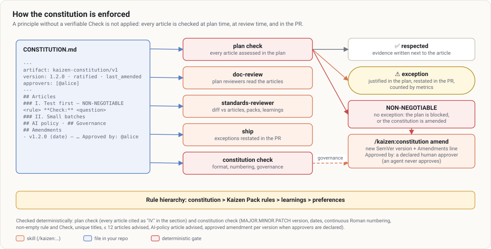

# The constitution

`CONSTITUTION.md`, at the repo root, holds the project’s **non-negotiable engineering principles**:
how things are built here and what an agent may do on its own. The idea comes from GitHub’s Spec Kit;
Kaizen adds what makes it bite: every article carries a **Check** that the plan must pass and the
review verifies. Write and evolve it with [`/kaizen:constitution`](../guides/constitution.md).



## Format (`kaizen-constitution/v1`)

```markdown
---
name: Shop
version: 1.2.0
ratified: 2026-10-02
last_amended: 2026-11-03
artifact: kaizen-constitution/v1
approvers: [@alice, @bob]      # optional: team governance
ratified_by: alice             # expected when approvers are declared
---

# Engineering constitution — Shop

## Articles

### I. Evidence first — NON-NEGOTIABLE

Every behavior change comes with a test that failed before the change.

**Check:** Does each unit of the plan, and each behavior change in the diff, have a test that was
observed failing first?

### II. Small batches

A PR stays under `pr.max_lines` reviewable lines; beyond that, the plan splits it into slices.

**Check:** Is every slice under the limit, or is the exception justified in the PR?

**Exceptions:** generated migrations, reviewed separately.

## AI policy

### III. Agent autonomy

Agents may create branches, commit, push a working branch and open a PR. They never merge, never push
to the default branch, never rewrite shared history.

**Check:** Is every irreversible action in the PR traced to a human approval?

## Governance

…

## Amendments

- v1.2.0 (2026-11-03) — Article II widened to generated code. Reason: … Approved by: @alice
```

How the parser reads it (`scripts/constitution.mjs`):

| Element | Rule |
|---|---|
| Article | a level-3 heading `### <Roman numeral>. <Title>`, in any `##` section (articles under *AI policy* count too) |
| Non-negotiable | the title ends with `— NON-NEGOTIABLE` (also `NON NÉGOCIABLE` from 2.x) |
| Rule | the text after the heading, until the next field |
| Check | `**Check:** …` (also `**Control:**`, `**Contrôle :**`) |
| Exceptions | `**Exceptions:** …` |
| Amendments | lines `- v<x.y.z> (<YYYY-MM-DD>) — <text>` under a `## Amendments` section; `Approved by: @a, @b` inside the text |

`node $K constitution` lists the articles and their checks; `--json` returns the parsed structure;
`node $K constitution check` validates it.

## Validation (`constitution check`)

Errors (exit 1):

- `version` not in `MAJOR.MINOR.PATCH` form; `ratified` or `last_amended` not `YYYY-MM-DD`;
  `last_amended` earlier than `ratified`;
- no article; numbering not continuous from `I` (no gaps);
- an article with an empty rule, or without a **Check** — *a principle without a verifiable check is
  not applied*;
- two articles with the same title;
- with `approvers` declared: no amendment for the current version (once past 1.0.0 or as soon as the
  log has entries), an amendment for the current version approved by nobody in `approvers`, or an
  amendment approved by an agent (`claude`, `agent`, `bot`, `ai`).

Warnings: `artifact` missing; more than 12 articles ("nobody applies them all anymore"); no
`ratified_by` while approvers are declared; no article about AI policy (recommended by DORA 2025).

## Where it is enforced

| Point | What happens |
|---|---|
| [`plan`](../guides/plan.md) | writes a `kaizen:constitution` table assessing **every** article: ✅ with evidence, or ⚠️ exception with a justification |
| `plan check` | fails if the section is missing or an article is not cited (as `IV.` at the start of a cell, bullet or line); warns on an exception without a visible justification |
| [`doc-review`](../guides/doc-review.md) | plan reviewers receive the constitution; the scope reviewer checks simplicity and small batches |
| [`review`](../guides/review.md) | the `standards-reviewer` checks the diff against the articles, quoting the violated rule; the report has a *Constitution* table |
| [`ship`](../guides/ship.md) | the plan’s exceptions are restated in the PR (*Constitution* section) |
| [`metrics`](../guides/metrics.md) | counts exceptions in recent plans (`constitution_exceptions`) |
| [`setup`](../guides/setup.md) / [`help`](../guides/help.md) | report a missing or invalid constitution |

**NON-NEGOTIABLE** articles admit no exception: if a plan cannot respect one, the plan is blocked
(open blocker in its goal capsule) or the constitution must be amended first.

## Hierarchy of rules

**constitution > Kaizen Pack rules > learnings > preferences.** When two sources disagree, the higher
one wins and the conflict is reported. A detailed rule for one area ("CSV exports start with a BOM")
belongs in a [pack](../packs.md), a past lesson in a [learning](learnings.md); the constitution only
keeps what holds for all the work, in 5 to 9 articles.

## Amendments and governance

`/kaizen:constitution amend <change>`:

1. asks **why now** — a postmortem, a recurring learning, an exception requested too often; an
   amendment without a reason is refused;
2. drafts the change with the same follow-up questions as the first interview;
3. lists the **impact**: plans in progress (`plan list` then `plan check` on each), pack rules and
   learnings that become contradictory;
4. bumps the version — MAJOR for an article removed or redefined incompatibly, MINOR for one added or
   widened, PATCH for a clarification — and `last_amended`, and appends a line to `## Amendments`
   with the reason;
5. with `approvers` declared, requires `Approved by: @<approver>` on that line: Claude asks who
   approved it, never writes a name you did not give and never an agent. Without approval the change
   stays a proposal (a PR touching `CONSTITUTION.md`, reviewed by the approvers through `CODEOWNERS`).
   Non-interactive modes only ever propose.

`/kaizen:constitution audit` is read-only: for each article, is the check verifiable and **actually**
applied? It looks at the last merged PRs or commits and recent plans — exceptions, exceptions without
justification, articles never cited — and reports each article as *alive*, *bypassed* or *dead* with
evidence and a proposal. A dead article should be amended or removed.

## Writing the first one

The first `/kaizen:constitution` is an interview, one question per turn: what broke most expensively
here, then 5 to 8 candidate articles from families such as evidence first, simplicity, no premature
abstraction, small batches, secure by default, compatibility (expand → migrate → contract),
observability, reversibility, and a mandatory **AI policy** (what agents do alone, what requires a
human in the session — merge, migration, new dependency, infrastructure, production data, deletion —
and what they never do). Vague principles get pushed back ("how would a reviewer know, reading a PR,
that it is respected?"); a rule a linter already enforces is not an article. NON-NEGOTIABLE is kept for
1 to 3 articles. A **stress test** of 3 to 5 concrete situations ("an urgent production fix without a
test, on a Friday night?") sharpens what the draft does not decide yet. Principles are never inferred
from the code: the code only sharpens the questions.
