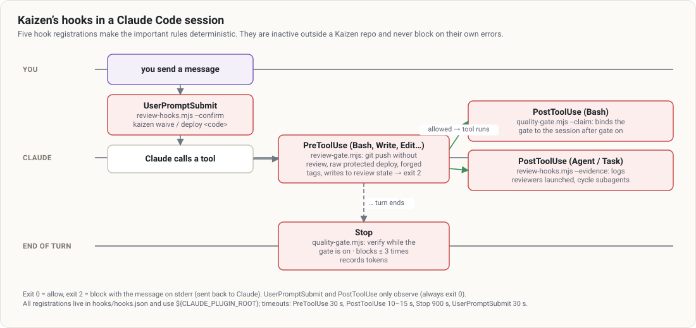
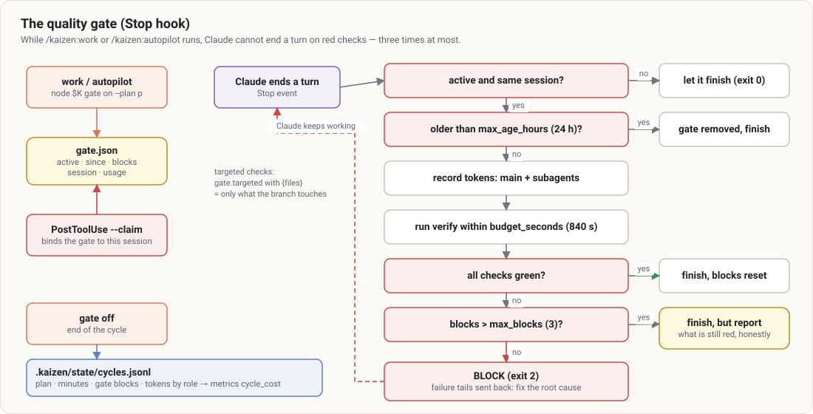

# Gates and hooks

Instructions can be forgotten; hooks cannot. Kaizen makes its few non-negotiable rules **deterministic**:
a hook or the CLI enforces them, and the evidence they rely on comes from other hooks rather than from
Claude’s own account. This page describes each gate, exactly what it checks, and how to get past it
legitimately.

## The hooks

Declared in [`hooks/hooks.json`](../../hooks/hooks.json):

| Event | Matcher | Script | Timeout | Blocks? |
|---|---|---|---|---|
| `PreToolUse` | `Bash\|Write\|Edit\|MultiEdit\|NotebookEdit` | `review-gate.mjs` | 30 s | yes (exit 2) |
| `PostToolUse` | `Bash` | `quality-gate.mjs --claim` | 10 s | no |
| `PostToolUse` | `Agent\|Task` | `review-hooks.mjs --evidence` | 15 s | no |
| `Stop` | — | `quality-gate.mjs` | 900 s | yes (exit 2) |
| `UserPromptSubmit` | — | `review-hooks.mjs --confirm` | 30 s | no |

Common rules:

- **Inactive outside a Kaizen repo.** The review and deployment gates require `.kaizen/config.json`;
  the quality gate requires an active `gate.json`.
- **Cheap first.** Each script filters on the tool name or the command text before importing anything,
  because PreToolUse sees every Bash command and every write.
- **Fail open on their own errors.** A broken hook lets the action through (and says so): a bug in
  Kaizen must never block your work.
- **Exit codes**: 0 allows, 2 blocks; the message on stderr is sent back to Claude, which reads why and
  what to do.

## The quality gate (Stop hook)

During [`/kaizen:work`](../guides/work.md) and [`/kaizen:autopilot`](../guides/autopilot.md), Claude
cannot end a turn while tests, lint or type checks are red.

Step by step:

1. `node $K gate on --plan 
` (run by work/autopilot) writes `.kaizen/state/gate.json`:
   `{ active, plan, since, blocks: 0 }`.
2. Right after, the **PostToolUse `--claim`** hook sees the `gate on` command and records the
   `session_id`. Another Claude Code session open on the same repo is then ignored by the gate.
3. At every **Stop** event, the hook:
   - exits 0 if the gate is inactive, belongs to another session, or `gate.enabled` is `false`;
   - removes the gate and exits 0 if it is older than `gate.max_age_hours` (24 h): an interrupted
     work must not trap future sessions;
   - records token usage since `gate on` from the transcript: the main session and every subagent
     transcript (`<session>/subagents/agent-*.jsonl`), deduplicated per message, broken down by role;
   - runs `verify` (test, lint, typecheck — never the dependency audit) within `gate.budget_seconds`
     (840 s): each command gets at most `gate.timeout_seconds` (600 s) and never more than what is left;
     a command that would not fit is skipped and reported, and a timed-out command has its whole
     process tree killed (`run-bounded.mjs`);
   - with `gate.targeted` (`{"test": "pnpm vitest related --run {files}"}`), runs those variants on the
     files the branch touches instead of the full commands;
   - all green → exit 0 (blocks reset);
   - red → increments `blocks` and exits 2 with the last lines of each failure: *fix the root cause,
     not the test*;
   - after `gate.max_blocks` (3) consecutive blocks → exit 0, telling Claude to report honestly what is
     still red. A failure out of reach never traps the session in a loop.
4. `node $K gate off` closes the cycle: it appends `{ plan, since, ended, minutes, gate_blocks, usage,
   subagents }` to `.kaizen/state/cycles.jsonl` (read by [metrics](metrics.md) as `cycle_cost`) and
   clears the subagent launch log.

If the failure is genuinely outside the plan’s scope, Claude may run `gate off` and must explain why.

## The review required before `git push` (PreToolUse)

### Recording a review

[`/kaizen:review`](../guides/review.md) ends with `node $K review record --verdict ready|concerns|blocked
[--run <folder>]`. It stores in `.kaizen/state/reviews.json`, per branch:

- `tree` — the git tree of the working copy **as reviewed** (committed + uncommitted, `.gitignore`
  honored), computed with a temporary index so your own index is untouched;
- `head`, `verdict`, `depth`, `reviewers`, `models` (the model actually requested for each reviewer),
  `run`, `at`.

The record **requires evidence**: the PostToolUse hook on the `Agent`/`Task` tool logs every Kaizen code
reviewer actually launched (`kaizen:<name>-reviewer`, or a `general-purpose` agent whose prompt carries
the review context and a `Reviewer:` line) into `review-evidence.json` (kept 12 h). Recording is
refused when no reviewer ran since the branch’s previous review, except:

| Depth | Accepted when |
|---|---|
| `agents` | at least one reviewer launched since the previous review |
| `light` | no reviewer, but the whole branch diff is ≤ 20 lines (the skill reviews it itself) |
| `update` | no reviewer, but ≤ `review.max_unreviewed_lines` (80) lines changed since the previously reviewed tree — the review’s own fixes; reviewers are carried over |

Plan reviewers (`plan-*`) never count as code review evidence. Verdicts `reserves` (2.x) are read as
`concerns`.

### The decision at push time

The PreToolUse hook recognizes `git push` (including `git -C dir push`) in any Bash command and calls
`checkPush`. In order:

| Situation | Result |
|---|---|
| `review.require_before_push: false` | allowed |
| detached HEAD, default branch, base not found, no code change on the branch | allowed (the default branch is guarded by the `git` plugin) |
| deleting a remote branch, pushing only tags | allowed (no new code) |
| no review recorded for the branch | **refused** |
| the reviewed tree no longer exists (history rewritten?) | **refused** |
| last verdict `blocked` and nothing changed since | **refused** |
| more than `max_unreviewed_lines` (80) changed since the reviewed tree | **refused** |
| otherwise | allowed — the reason (verdict, reviewers or waiver) is reported |

Line counts exclude `pr.ignore` (lockfiles, minified, snapshots, generated files, `dist/`, `vendor/`).
`node $K review check` runs the same decision without pushing (exit 1 if refused);
`node $K review status` shows the recorded review, a pending waiver and the decision.

### Waiving the review — only you

If you explicitly ask to skip the review:

1. Claude runs `node $K review waive --reason "<your request>"`, which stores a pending request and
   prints a 6-character code (valid 30 minutes, one per branch);
2. **you type** `kaizen waive <code>` in your own message;
3. the UserPromptSubmit hook — which only ever sees user messages — confirms it: the branch’s review
   becomes `verdict: waived` with your reason;
4. the push is allowed, and [`ship`](../guides/ship.md) adds a mandatory **Review waived** section to
   the PR.

Claude cannot type the code for you, and non-interactive modes never waive.

### Tamper protection

The same PreToolUse hook refuses:

- Bash commands or file writes touching `reviews.json`, `review-evidence.json`, `waivers.json`,
  `deploy-approvals.json` or `deployments.jsonl` under `.kaizen/state/`, or calling `review-hooks.mjs`
  by hand;
- hand-made `deploy/…`, `rollback/…`, `incident/…` and `resolve/…` git tags (listing and deleting are
  allowed): they carry the DORA metrics and postmortem timelines;
- the raw deploy command of a **protected** environment (see [production](production.md)).

These gates stop forgetfulness and drift, not a determined attempt to bypass them; they make bypassing
visible and deliberate.

## Other deterministic checks

Not hooks, but CLI checks the skills must pass and cannot argue with:

| Check | Command | Fails when |
|---|---|---|
| verification | `node $K verify [--only test,lint\|audit]` | any configured or detected check is red (exit 1) |
| plan structure | `node $K plan check <plan>` | see [Plans](plans.md#everything-plan-check-verifies) |
| batch size | `node $K size [--base ref] [--max n]` | the branch diff exceeds `pr.max_lines` (exit 1) |
| constitution | `node $K constitution check` | see [Constitution](constitution.md#validation-constitution-check) |
| learnings | `node $K learnings validate` | invalid frontmatter (exit 1) |
| deployment approval | `node $K deploy run <env>` | protected environment without your confirmed code |

`verify` runs the commands from `.kaizen/config.json → verify`, filling the gaps with what it detects
(`node $K detect`): npm/pnpm/yarn/bun scripts (`test`, `lint`, `typecheck`…, `tsc --noEmit` with a
`tsconfig.json`), pytest/ruff/mypy (with uv or poetry), `go test`/`go vet`, cargo test/clippy, Maven,
Gradle, RSpec/rake/RuboCop, PHPUnit, `make test`; dependency audits (`npm audit`, `pip-audit`,
`govulncheck`, `cargo audit`, `bundle-audit`) only with `--only audit`.
