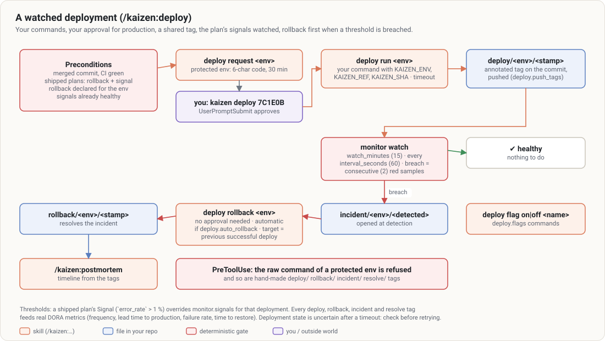
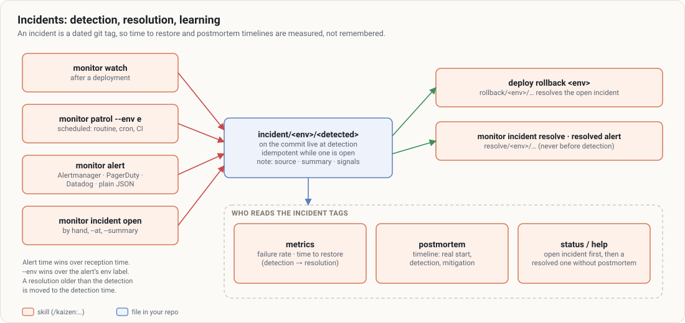

# Production: release, deploy, monitor, incidents

Kaizen does not stop at the merged PR. A plan says how it reaches production and what to watch; a
release turns merged work into a version and a checklist; a deployment runs **your** commands, waits for
**your** approval on protected environments, records a shared tag and watches the plan’s signals; an
incident is a dated tag that feeds the metrics and the postmortem. Guides:
[`release`](../guides/release.md), [`deploy`](../guides/deploy.md), [`monitor`](../guides/monitor.md),
[`postmortem`](../guides/postmortem.md); configuration:
[`deploy`](../configuration.md#deploy--deployment-and-rollback) and
[`monitor`](../configuration.md#monitor--production-signals).

## Release

`node $K release notes [--from <tag>] [--to <ref>]`:

- range: from `--from`, otherwise the last tag that is **not** a `deploy/` or `rollback/` tag
  (`git describe --tags --exclude`), to `HEAD`;
- each non-merge commit parsed as a conventional commit `type(scope)!: description`; breaking if `!` or
  `BREAKING CHANGE:` / `BREAKING-CHANGE:` in the body;
- groups: **Features** (`feat`), **Fixes** (`fix`), **Performance**, **Refactoring**, **Documentation**,
  **Reverts**, **Other** (non-conventional and unknown types); `chore`, `ci`, `build`, `test`, `style`
  are left out;
- proposed level: major if anything breaks, minor if a `feat`, patch otherwise — in `0.x`, a breaking
  change bumps the **minor**;
- `rollout`: the plans shipped in the range (modified in it, or cited by a commit like
  "Unit U3 of plan docs/plans/…"), each with its Exposure, Order, Rollback, Signal and the fields
  **missing** — a plan without rollback or signal is flagged before the release, not discovered during
  the incident.

`/kaizen:release` then checks hidden breaking changes in public interfaces, compares the project’s
version files, writes user-facing notes and the CHANGELOG (Keep a Changelog), builds the production
checklist, and only with `publish` and your approval: version bump, `chore(release): vX.Y.Z`, annotated
tag, push, `gh release create`. It proposes `/kaizen:deploy` but never deploys.

## Deploy



### Configuration

```json
"deploy": {
  "environments": {
    "staging":    { "command": "make deploy ENV=staging", "rollback": "make rollback ENV=staging" },
    "production": { "command": "make deploy ENV=production", "rollback": "make rollback ENV=production",
                    "url": "https://shop.example", "timeout_seconds": 1200 }
  },
  "watch_minutes": 15, "auto_rollback": false, "push_tags": true, "timeout_seconds": 1800,
  "flags": { "on": "unleash toggle {flag} --env {env} --on", "off": "unleash toggle {flag} --env {env} --off" }
}
```

Kaizen knows no platform and never invents a command. `node $K deploy detect` recognizes common setups
and proposes commands, a native rollback (or a redeploy of the previous commit from a throwaway git
worktree), a health-check signal, a confidence level and notes; `node $K deploy configure <id>` writes
the chosen candidate without overwriting an existing environment (`--force` to replace):

| Recognized from | Platform |
|---|---|
| `vercel.json`, `.vercel/` | Vercel (`vercel rollback`) |
| `netlify.toml` | Netlify |
| `fly.toml` | Fly.io (app name, health-check) |
| `heroku` remote, `app.json` | Heroku (`heroku rollback`) |
| `config/deploy.yml` (+ destinations) | Kamal (`kamal rollback`) |
| `config/deploy.rb` (+ stages) | Capistrano (`cap <stage> deploy:rollback`) |
| `Chart.yaml` (+ `values-<env>.yaml`) | Helm (`helm rollback`) |
| `kustomization.yaml` overlays | Kustomize (`kubectl rollout undo`) |
| `serverless.yml`, `template.yaml`, `firebase.json` | Serverless, AWS SAM, Firebase |
| GitHub Actions `workflow_dispatch` workflow | your pipeline (rollback = same workflow on the target ref, if it has a `ref` input) |
| deploy workflow on `push` | continuous deployment (Kaizen follows the commit’s run; rollback by revert) |
| Makefile `deploy*`/`rollback*` targets, npm scripts | your scripts |
| `docker-compose*.yml`, `*.tf` | Compose, Terraform (low confidence) |

### The run

1. **Preconditions** (by `/kaizen:deploy`): merged commit, CI green, what ships since the last
   deployment (commits and plans, each with its rollback and signal — a plan without them blocks a
   protected deployment), a declared rollback, signals already healthy (no deploying on top of an
   incident).
2. **Approval** for a protected environment (`production` by default, or `"protected": true`):
   `node $K deploy request <env> [--ref r]` stores a pending approval for that environment **and that
   commit** and prints a 6-character code, valid 30 minutes; **you** type `kaizen deploy <code>`; the
   UserPromptSubmit hook confirms it. Autonomous modes have no protected deployment.
3. `node $K deploy run <env> [--ref r]` consumes the approval, runs your command with `KAIZEN_ENV`,
   `KAIZEN_REF` and `KAIZEN_SHA` in the environment, bounded by `timeout_seconds` (whole process tree
   killed beyond it — the environment’s state is then uncertain and the report says so), logs a line in
   `.kaizen/state/deployments.jsonl`, and on success creates an **annotated tag**
   `deploy/<env>/<YYYYMMDDTHHMMSSZ>` on the commit (note: env, sha, approval time, shipped plans), pushed
   if a remote exists.
4. **Watch**: `monitor watch` for `watch_minutes`, thresholds from the shipped plans overriding the
   configuration.
5. **Breach** → an incident tag, then **rollback first**: `node $K deploy rollback <env> [--reason …]
   [--to ref]` runs your rollback command towards the previous successful deployment (or `--to`), needs
   no approval (it restores service and it is urgent), and creates a `rollback/<env>/…` tag. With
   `deploy.auto_rollback`, `monitor watch` rolls back by itself. Then `/kaizen:postmortem`.

`node $K deploy list [--env e]` rebuilds the history from the tags (shared with the team);
`node $K deploy flag on|off <name> [--env e]` runs your feature flag commands (`{flag}`, `{env}`
replaced). The PreToolUse hook refuses the raw deploy command of a protected environment and any
hand-made deployment tag.

## Monitor

### Signals

```json
"monitor": {
  "signals": {
    "health":     { "type": "http", "url": "https://{env}.shop.example/health", "expect": [200, 204] },
    "error_rate": { "command": "./scripts/error-rate.sh {env}", "max": 0.01 },
    "p95_ms":     { "command": "./scripts/p95.sh", "max": 800, "env": "production", "timeout_seconds": 20 }
  },
  "interval_seconds": 60, "consecutive": 2
}
```

- `type: "http"` — native check, no tool: the status must be in `expect` (200 by default), timeout
  `timeout_seconds` (10 s), redirects not followed.
- `command` — anything that prints a number as its **last word** (Prometheus, Datadog, CloudWatch, SQL,
  `grep -c` on logs), timeout 30 s by default, `KAIZEN_ENV` set; a failing command or non-numeric output
  is **blind**: red in `check` (a blind signal is not a healthy one), but never a breach — the measuring
  tool is broken, not necessarily the service. `watch` and `patrol` neither roll back nor open an
  incident for it (a false incident would distort DORA metrics); blind on `consecutive` samples, their
  result is `blind` (exit 1, environment not verified). An unreachable HTTP health-check is not blind:
  it is the outage. If your metrics endpoint is served by the application itself, also declare an HTTP
  health-check, so that a real outage is not mistaken for a broken measurement.
- `max` / `min` — thresholds; `env` restricts a signal to some environments; `{env}` is replaced in
  `url` and `command`.

`node $K monitor check [--env e] [--plan p]` samples every signal once in parallel (exit 1 if one is
out of threshold) and reports where each threshold came from (`config` or `plan`) plus the signals a
plan cites but the configuration does not declare (a monitoring gap). Without `--plan`, the plans of
the environment’s last deployment are used.

### Watch, patrol, alert

| Command | When | Breach |
|---|---|---|
| `monitor watch [--env e] [--minutes 15] [--interval 60]` | right after a deployment | `consecutive` red samples of the same signal → incident (and rollback with `auto_rollback`), exit 1; blind signal → `blind`, exit 1, no rollback |
| `monitor patrol --env e [--interval 60]` | scheduled: Claude Code routine, cron, CI workflow | a red signal is re-measured up to `consecutive` samples; confirmed → incident, exit 1; blind signal → `blind`, exit 1, no incident |
| `monitor alert [--env e] [--file f\|-]` | your alerting tool calls it (e.g. a `repository_dispatch` workflow) | firing → incident opened; resolved → incident resolved |
| `monitor incident open\|resolve --env e [--at iso] [--summary …]` · `monitor incident list [--env e]` | by hand | — |

Watch and patrol samples are appended to `.kaizen/state/monitor.jsonl` (postmortem timelines read them). `node $K audit fix monitor_patrol` and
`audit fix monitor_alert` generate the GitHub Actions workflows (`--env`, `--ref <sha>` to pin Kaizen).

Recognized alert payloads:

| Tool | Opening | Resolution | Time used |
|---|---|---|---|
| Prometheus Alertmanager | `status: firing` | `status: resolved` | earliest `startsAt` / latest `endsAt` |
| PagerDuty v3 webhook | `incident.triggered` | `incident.resolved` | `occurred_at` (other events ignored) |
| Datadog webhook | `alert_transition: Triggered` | `Recovered` | `date` |
| Plain JSON | `{"status": "firing", "summary", "at", "env"}` | `"status": "resolved"` | `at` |

`--env` wins over the alert’s `env`/`environment` label; the alert’s time wins over the reception time.

## Incidents



- An incident is an annotated tag `incident/<env>/<detected>` on the commit that was **live at the
  detection time** (an alert older than the last deployment does not blame it), with a note: source,
  summary, signals.
- Opening is **idempotent** while an incident is open on that environment: one outage is never counted
  twice.
- It is resolved by the first following `rollback/<env>/…` or `resolve/<env>/…` tag. A resolution dated
  before the detection (clock differences) is moved to the detection time; an incident dated before the
  last resolution is placed right after it.
- Consumers: [metrics](metrics.md) (an incident before the next deployment makes that deployment a
  failure; time to restore = detection → resolution), the postmortem timeline, and `status`/`help`,
  which put an open incident first and a resolved one without a postmortem (within 14 days) right after.

## Postmortem

`/kaizen:postmortem` gathers the facts (your account, `git log` over the window, CI runs, merged PRs,
releases, `deploy/`, `rollback/` and `incident/` tags, `monitor.jsonl`, provided logs), asks the missing
questions one at a time, and writes `docs/postmortems/YYYY-MM-DD-<title>.md`: summary, impact, timeline
(UTC, each line sourced), contributing factors (plural), what went well, near misses, 3–7 actions with
owners, and the Kaizen loop — learning, regression test, pack rule, constitution amendment. Its
`detected` / `resolved` frontmatter feeds the time to restore when no incident tag exists.
