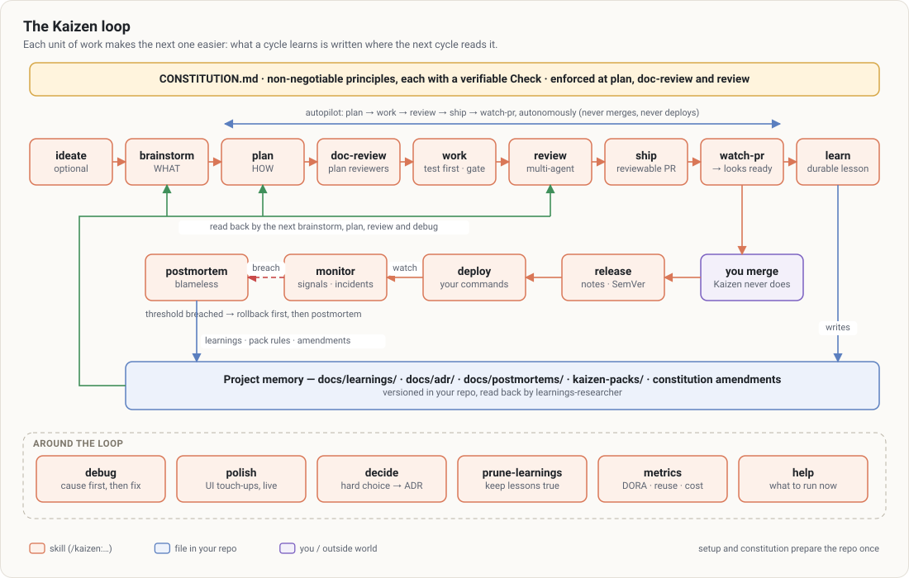
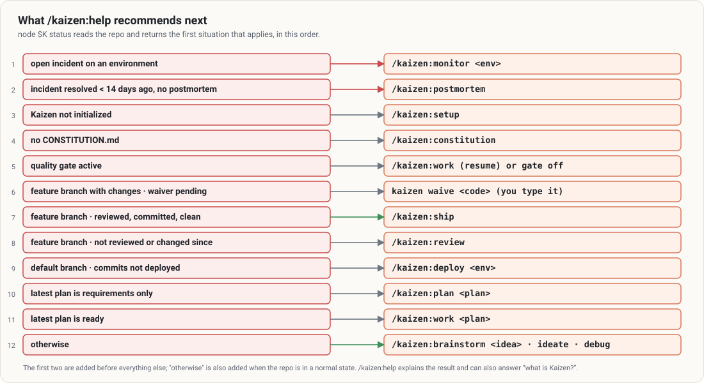
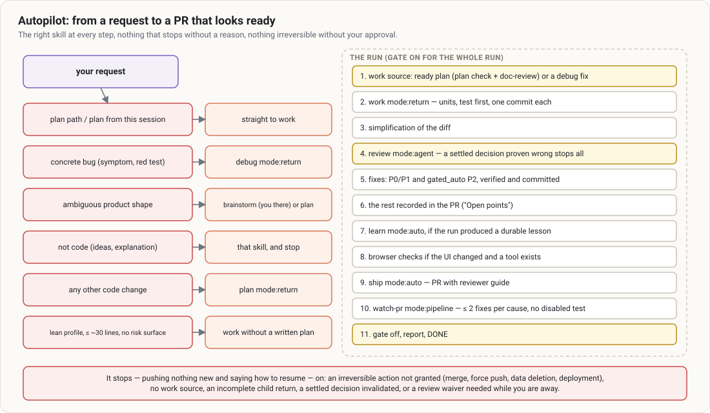
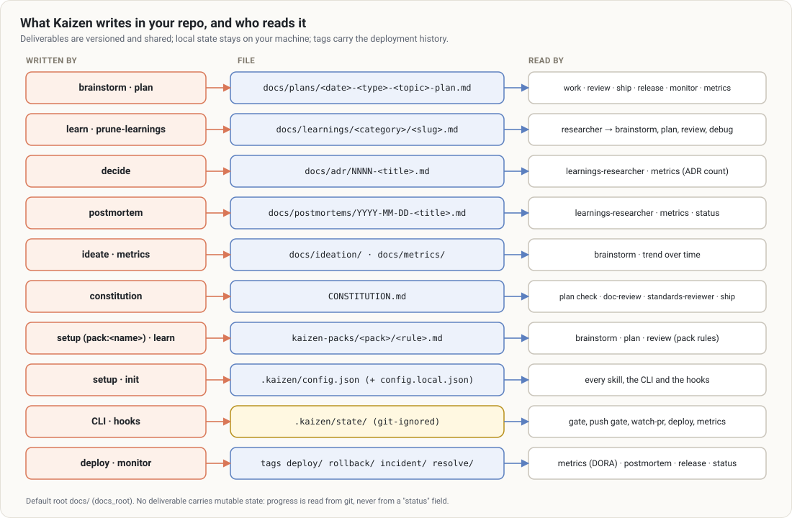

# The Kaizen loop

Kaizen organizes work with Claude Code as a loop whose output is not only code but **knowledge the next
cycle reads**. This page explains the loop end to end: the steps, who decides what, what is
automated, what stays yours, and how the parts fit together. Each skill has its own
[guide](../README.md#the-guides-skill-by-skill); the mechanisms are detailed in the other
[concept pages](../README.md#how-it-works).

## The principle

> Each unit of work must make the next one easier.

Two consequences shape everything else:

- **Most of the effort goes into deciding and checking, not typing.** Roughly 80 % planning and
  review, 20 % execution. A defect caught in a plan costs a sentence; in code, a PR; in production, an
  incident.
- **What a cycle learns is written where the next cycle reads it.** A learning in
  `docs/learnings/` is searched by the `learnings-researcher` agent at the next brainstorm, plan,
  review and debug. A postmortem turns into learnings, pack rules and constitution amendments. That
  feedback is what makes the effect compound; [`/kaizen:metrics`](../guides/metrics.md) measures
  whether it really happens.

## The steps

| Step | Skill | Question it answers | Output |
|---|---|---|---|
| Principles (once) | [`constitution`](../guides/constitution.md) | Which rules are non-negotiable here? | `CONSTITUTION.md` |
| Ideas (optional) | [`ideate`](../guides/ideate.md) | What is worth doing? | `docs/ideation/…` |
| What | [`brainstorm`](../guides/brainstorm.md) | What should it be, for whom, what is out of scope? | plan file: goal capsule + product contract (R…, AE…) |
| How | [`plan`](../guides/plan.md) | How do we build it safely? | same plan file: decisions (KTD…), units (U…), slices, rollout |
| Plan review | [`doc-review`](../guides/doc-review.md) | Will this plan work? | fixes applied in place, decisions for you |
| Build | [`work`](../guides/work.md) | Build it, test first | one commit per unit, quality gate on |
| Check | [`review`](../guides/review.md) | Is it correct, and is it what was planned? | findings, verdict, recorded review |
| Ship | [`ship`](../guides/ship.md) | Can a human review this PR quickly? | PR with reviewer guide |
| Follow | [`watch-pr`](../guides/watch-pr.md), [`address-feedback`](../guides/address-feedback.md) | Is the PR ready to merge? | feedback handled, CI repaired, a true final state |
| **You merge** | — | — | Kaizen never merges |
| Release | [`release`](../guides/release.md) | Which version, what changed, how to go live? | notes, SemVer, CHANGELOG, checklist |
| Deploy | [`deploy`](../guides/deploy.md) | Release it, watch it, roll back if needed | `deploy/<env>/…` tag, signal watch |
| Operate | [`monitor`](../guides/monitor.md) | Is production healthy? | samples, incidents (`incident/<env>/…`) |
| Learn | [`learn`](../guides/learn.md), [`postmortem`](../guides/postmortem.md) | What should the next cycle know? | learnings, pack rules, amendments |

Around the loop: [`debug`](../guides/debug.md) (cause before fix), [`polish`](../guides/polish.md)
(user-guided UI touch-ups on a running dev server), [`decide`](../guides/decide.md) (hard decisions as
ADRs), [`prune-learnings`](../guides/prune-learnings.md) (keep the memory true),
[`metrics`](../guides/metrics.md) (is it working?), [`help`](../guides/help.md) (what to run now) and
[`setup`](../guides/setup.md) (install, check, audit).

## Who decides what

| Decision | Who |
|---|---|
| What the product must do, the scope, the trade-offs | **you**, through one question at a time (brainstorm, plan, doc-review) |
| How to build it, within the plan | Claude, with justified decisions you can read (KTD) |
| Whether checks pass, whether a review happened, whether a push may go | **deterministic gates** (CLI and hooks), not Claude’s word |
| Skipping the review, deploying to a protected environment | **only you**, by typing a code yourself |
| Merging a PR | **only you** |
| Changing the constitution | a declared human approver (an agent never approves) |

The [gates and hooks](gates-and-hooks.md) page explains how the deterministic part is enforced.

## What runs automatically

Five hook registrations work without you invoking anything (see [hooks](gates-and-hooks.md#the-hooks)):

- a **Stop** hook keeps Claude from finishing a turn on red checks during `work` and `autopilot`;
- a **PreToolUse** hook refuses `git push` of an unreviewed branch, the raw deploy command of a
  protected environment, hand-made deployment tags and direct writes to the review state;
- two **PostToolUse** hooks bind the quality gate to its session and log which reviewers really ran;
- a **UserPromptSubmit** hook recognizes `kaizen waive <code>` and `kaizen deploy <code>` in your own
  messages.

## Knowing where you are

`/kaizen:help` (backed by `node $K status`) reads the repo and recommends the next command. It walks
these situations in order and stops at the first that applies:

Details: [`help`](../guides/help.md), and `node $K status --json` for the raw diagnosis (branch,
commits ahead, uncommitted files, profile, constitution validity, plans, learnings, gate, deployments,
incidents, review state, next steps).

## Autopilot

[`/kaizen:autopilot`](../guides/autopilot.md) chains the loop after the brainstorm without stopping
for confirmation at each step. It routes the request, then runs work → simplification → review with
fixes → learn → browser checks → ship → watch-pr, with the quality gate on for the whole run.

It never merges, never deploys, never waives a review, and stops — pushing nothing new — when an
irreversible action was not granted.

## Where everything lives

Kaizen writes deliverables into your repo (versioned, shared), keeps working state in `.kaizen/state/`
(local, ignored by git) and records deployments as git tags (shared through the remote):

No deliverable carries a mutable status ("in progress", "done"): progress is read from git. See
[State and files](../reference/state-and-files.md) for every file.

## Adoption profiles

`profile` in `.kaizen/config.json` scales the **ceremony**, never the gates:

| | `lean` | `standard` (default) | `full` |
|---|---|---|---|
| Plan | requirements, units, verification; threats and rollout only on a risk surface or production change | complete | complete, threats and rollout always |
| doc-review | plan check + coherence | coherence, feasibility + conditional reviewers | every relevant reviewer, adversarial always |
| review | correctness, standards (+ security on a risk surface) | depending on the diff | depending on the diff, adversarial from targeted depth |
| autopilot | ≤ ~30 lines without a risk surface: work without a written plan | always a plan | always a plan |
| learn | proposed when the durability test is obvious | proposed | always assessed |
| models | cheapest that works | balanced | strongest |

A **risk surface** is auth, sessions, permissions, personal or payment data, migrations, public APIs or
dependencies. The Stop-hook gate, `verify`, `size`, `plan check` and the review required before
`git push` stay active in every profile. Choose it by the stakes of the repo, not by the team's
experience: `lean` for a prototype or internal tool, `standard` for a product in production, `full` for
regulated or critical domains. See [Agents and models](agents-and-models.md) for the model side.

## Language

Kaizen’s instructions are in English; Claude talks to you in your language. Deliverables (plans,
learnings, ADRs, postmortems, PR descriptions, review replies) follow `language` (`auto` = the
conversation’s language). Markers (`<!-- kaizen:units -->`), frontmatter keys, ids (R1, AE1, KTD1, U1,
S1), CLI commands and confirmation phrases are never translated, because tools read them. Plans and
constitutions written in French with Kaizen 2.x are still parsed.
