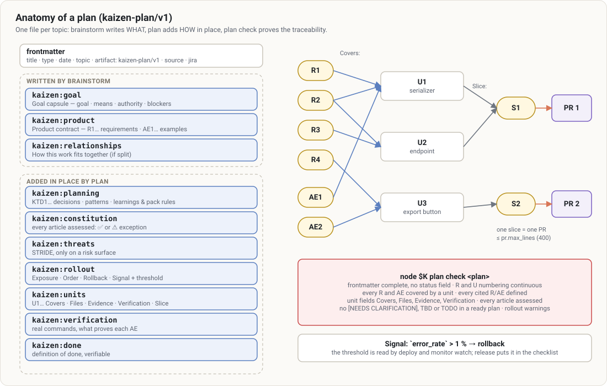

# `/kaizen:plan`

> Decide **how** to build: parallel research, justified decisions, testable work units, rollout and
> rollback. Without ever writing production code.

The Kaizen plan is a document of **decisions**, not an implementation script. It says what was decided
and why, what is in or out of scope, which work units exist, which files they touch, which tests must
pass, and how to roll back. The implementer (`/kaizen:work` or a human) keeps judgment over the code.

## At a glance

| | |
|---|---|
| **What it does** | Research (repo patterns, learnings, history, external docs) → decisions (KTD) → constitution check, threats, rollout → units grouped into PR slices → `plan check` → `/kaizen:doc-review` |
| **When to use it** | After a brainstorm; a clear but non-trivial request; a ticket or a spec to turn into executable work; deepening an existing plan |
| **When not to use it** | Idea still fuzzy (→ [brainstorm](brainstorm.md)); bug without a known cause (→ [debug](debug.md)); a one-line change: just ask for it |
| **What it produces** | The unified plan enriched **in place** (or a new `docs/plans/…-plan.md` file); for small work, a direct statement or a brief in the chat |
| **What next** | "Plan ready: `<path>`. What do you want to do?" → `work` (recommended), `autopilot`, deepen, review it yourself |

## Examples

```text
/kaizen:plan                                              # the plan written by this session's brainstorm
/kaizen:plan docs/plans/2026-10-02-1430-feat-orders-csv-export-plan.md
/kaizen:plan add a daily email digest at 8 am UTC
/kaizen:plan deepen docs/plans/2026-09-12-0900-refactor-auth-plan.md
```



In depth: [plans](../concepts/plans.md).

## How it goes

1. **Source and shape**:
   - **Direct**: the change is stated in a few sentences;
   - **Brief**: the plan fits in the chat;
   - **Durable**: a file. Always the case for auth, payment, a migration or an external contract.
2. **Parallel research**: `repo-researcher` (patterns to imitate, with exact paths),
   `learnings-researcher` (learnings, ADRs, postmortems, pack rules), and when useful `git-historian`,
   `docs-researcher` (behavior in your lockfile's version) and `flow-analyst`. See
   [agents and models](../concepts/agents-and-models.md#research-agents).
3. **Decisions**: each KTD has a reason, a rejected alternative and the requirements it covers. An
   applicable learning **changes** the plan and is cited in it.
4. **Kaizen-specific sections**:
   - **Constitution check**: one verdict per article. A NON-NEGOTIABLE article that cannot be respected
     blocks the plan.
   - **Threats** (lightweight STRIDE) if the area is sensitive, each countermeasure carried by a unit.
   - **Rollout and rollback**: exposure (flag?), order, rollback, what is irreversible, signal to watch
     **with its threshold** (`` `error_rate` > 1 % → revert ``). `plan check` reports a missing
     rollback or signal, and a signal without a threshold; `/kaizen:release` turns it into the
     production checklist and `/kaizen:deploy` watches it.
   - The **profile** adjusts the ceremony: in `lean`, threats and rollout only if the change touches a
     risk surface or production; in `full`, always.
5. **Units** U1…: goal, `Covers`, files, approach (cited pattern), **evidence** (test first by
   default), test scenarios, executable verification, **slice**. A slice is a PR under
   `pr.max_lines`, which leaves the default branch healthy.
6. **Checks**:
   - `node $K plan check` must pass;
   - confidence check;
   - **mandatory** `/kaizen:doc-review mode:auto`, which fixes what is mechanical and asks you the
     remaining decisions.

## What `plan check` verifies

Above all that **each R and each AE is covered by a unit**, that each unit has its evidence and
verification, that no `[NEEDS CLARIFICATION: …]` is left and that every constitution article is assessed.
Every rule: [plans](../concepts/plans.md#everything-plan-check-verifies). Full example:
[`templates/plan-example.md`](../../templates/plan-example.md).

## Options

| Option | Effect |
|---|---|
| `deepen <path>` | deepens the weak sections through targeted research, integrated in place; adds `deepened:` to the frontmatter |
| `mode:return` | no questions: assumptions recorded, structured result (used by `autopilot`) |

## Good to know

- **Build what is asked**: an unrequested mechanism (retry, option, abstraction) only enters the plan
  if its absence lets harm go unnoticed, or if it would be expensive to add later. And then in its
  smallest form.
- For a heavy or irreversible decision, the plan proposes `/kaizen:decide` rather than settling it in
  one line.
- No trace of the process in the file ("in phase 2, I…").

## See also

[brainstorm](brainstorm.md) · [doc-review](doc-review.md) · [work](work.md) · [decide](decide.md)
