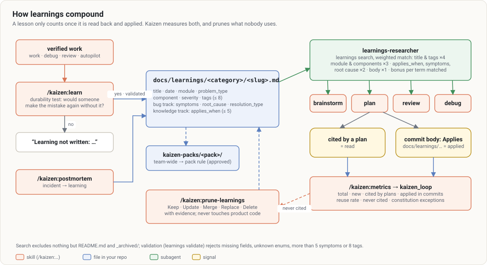

# `/kaizen:prune-learnings`

> Keep the learnings trustworthy: each one is checked against the current code, then kept, updated,
> merged, replaced or deleted, with evidence.

A wrong learning is **worse** than no learning, because `plan` and `review` apply it. `prune-learnings`
is the maintenance of the corpus.

## At a glance

| | |
|---|---|
| **What it does** | Validates the frontmatter, checks each learning (paths, symbols, behavior, `retire_when`), detects duplicates and contradictions, classifies, applies, reports |
| **When to use it** | After a big refactor, a migration or an upgrade; when a learning turned out wrong; when `metrics` shows learnings never reused; every quarter |
| **When not to use it** | Writing a new learning (→ [learn](learn.md)) |
| **What it produces** | Corrected learnings, an "Applied / Recommended" report, a commit of the touched files only |
| **What next** | Contradictions with instructions are reported to you, to settle |

## Examples

```text
/kaizen:prune-learnings                       # all of docs/learnings/
/kaizen:prune-learnings exports               # one area (folder, module, keyword)
/kaizen:prune-learnings prune                 # also judge the value (after confirmation)
/kaizen:prune-learnings mode:auto
```



In depth: [learnings](../concepts/learnings.md#pruning).

## The five outcomes

| Outcome | When |
|---|---|
| **Keep** | accurate and distinct |
| **Update** | the substance holds, details drifted (moved path, renamed symbol, invalid frontmatter) |
| **Merge** | several learnings say the same thing: the best one is kept, enriched, and the others deleted |
| **Replace** | the substance became wrong, but the area deserves a learning: rewritten from the current code |
| **Delete** | the problem can no longer happen and the learning teaches nothing anymore |

Boundary: if a reader of the old version would make a **wrong decision**, it is Replace.

## Good to know

- **Never modifies product code**, nor a skill, a runbook or `CLAUDE.md`. A contradiction with an
  instruction is **reported**, with both quotes and what the code does.
- Interactively, Replace and Delete ask for your approval. In `mode:auto`, those learnings are only
  marked "Possibly stale" and listed.
- **Unverifiable is not wrong**: a learning about a production behavior that cannot be observed stays,
  with a note.
- `prune` also deletes **accurate** learnings whose reasoning is now carried by a test or a comment.
  Each deletion cites the file that justifies it, and nothing goes without your confirmation.
- No `_archived` folder: git history is the archive.

## See also

[learn](learn.md) · [metrics](metrics.md)
