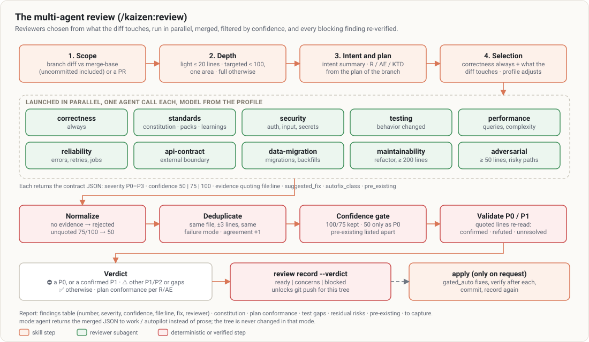

# `/kaizen:review`

> A code review by specialized reviewers, chosen by what the diff touches, whose every blocking finding
> is verified before being reported.

## At a glance

| | |
|---|---|
| **What it does** | Scope → intent and plan → reviewer selection → parallel launch → merge, confidence filtering, P0/P1 verification → report with a verdict |
| **When to use it** | Before shipping (mandatory in `work`); on a PR to review; after a non-trivial fix |
| **When not to use it** | Reviewing a **plan** (→ [doc-review](doc-review.md)); handling comments already posted on a PR (→ [address-feedback](address-feedback.md)) |
| **What it produces** | A report: verdict ✅ ready / ⚠️ concerns / ⛔ not ready, numbered findings, constitution compliance, plan conformance, test gaps, risks, pre-existing problems, what deserves a learning |
| **What next** | `apply` to apply the fixes, or "apply 1, 3 and 4" |

## Examples

```text
/kaizen:review                              # current branch vs its base (uncommitted included)
/kaizen:review 42                           # PR #42 (without switching branches)
/kaizen:review base:release/2.3
/kaizen:review plan:docs/plans/…-plan.md    # check conformance to this plan
/kaizen:review apply                        # review then apply the fixes
```



In depth: [review](../concepts/review.md).

## The reviewers

| Reviewer | When |
|---|---|
| `correctness-reviewer` | always. Mentally executes the code: boundaries, null, state, swallowed errors, unmet intent |
| `standards-reviewer` | as soon as there is a constitution, standards, a pack rule or a relevant learning. Applies each constitution **Check** and quotes the violated rule |
| `testing-reviewer` | tests touched, or behavior changed |
| `security-reviewer` | auth, user input, endpoints, secrets, crypto… (OWASP and CWE in the title) |
| `performance-reviewer` | queries, heavy loops, fan-out, cache |
| `reliability-reviewer` | errors, retries, timeouts, jobs, external calls |
| `api-contract-reviewer` | externally consumed interface |
| `data-migration-reviewer` | migrations, backfills, schemas |
| `maintainability-reviewer` | refactors, new abstractions, ≥ 200 lines |
| `adversarial-reviewer` | ≥ 50 lines, or risk (auth, payment, concurrency, CI…): builds failure scenarios |

Selection is made **by judgment on the real diff**, and each chosen reviewer is justified in one line.
For a diff of 20 lines or fewer, without risk: direct review, without subagents. Each reviewer runs
with the model of its role ([`models`](../configuration.md#models--the-right-model-for-each-task));
the model actually requested is recorded.

## What makes the findings reliable

- **Shared contract** ([`references/review-contract.md`](../../references/review-contract.md)):
  - severity P0 to P3;
  - confidence anchored at 50, 75 or 100;
  - a concrete fix proposed, with its assumptions named;
  - a list of non-findings to keep quiet (style, what the linter catches, intentional code…).
- **"Quote the line" rule**: no confidence of 75 or more without the verbatim line with `file:line`.
- **Validation**: the orchestrator rereads the lines of each P0 and P1 itself. A refuted finding is
  removed. A protected topic (data loss, access, injection, secrets) can only be dismissed on evidence.

Real example, from an evaluation: a diff with `execSync(\`grep "${customer}" …\`)` and
`Math.floor(total / size)` gives the ⛔ verdict. The command injection comes out as **P0** (100) and the
lost last page as **P1**. The orchestrator also corrected two reviewers' wrong line numbers.

## Options

| Option | Effect |
|---|---|
| `apply` | applies the `gated_auto` fixes, one by one, verifying again after each; the `manual` ones stay listed |
| `mode:agent` | JSON return without prose or changes (used by `work` and `autopilot`) |
| `plan:<path>` | reference plan for conformance |
| `base:<ref>` | comparison base |

## Good to know

- The review is **recorded** for the current branch (`node $K review record`): that is what the push
  hook requires before any `git push`. After more than `review.max_unreviewed_lines` changed lines (80
  by default), a new review is needed. Recording requires that reviewers actually ran (logged by a
  hook), except for a light review of 20 lines at most.
- The profile (`lean`, `standard`, `full`) adjusts the number of reviewers, never the review
  obligation.
- **Report only by default**, never a push. A PR passed as argument sets the **scope**, not the
  permission to switch branches.
- The reviewers' raw returns are kept in `.kaizen/state/reviews/<timestamp>/`.

## See also

[doc-review](doc-review.md) · [work](work.md) · [constitution](constitution.md) · [ship](ship.md)
