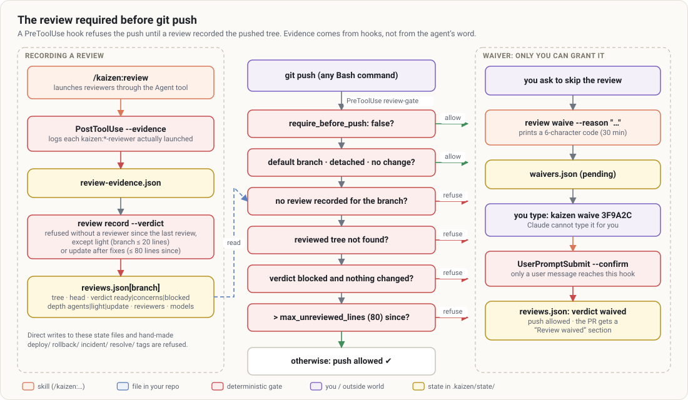

# `/kaizen:ship`

> Ship as a PR reviewers want to review: small, telling its own story, and saying where to look.

DORA 2025 measured it: with AI, PRs grow, and **human review becomes the bottleneck**. `ship` checks,
controls the size, pushes, and writes the description from the plan and the real diff, with a
**reviewer guide**.

## At a glance

| | |
|---|---|
| **What it does** | Preconditions → barriers (green checks, review done, size) → commits and push → description → PR opened or updated |
| **When to use it** | At the end of `/kaizen:work` (offered automatically); "open the PR"; "update the description" |
| **When not to use it** | Unverified or unreviewed work: `ship` will run the review first |
| **What it produces** | A pushed branch, an opened (or updated) PR and its URL |
| **What next** | `/kaizen:watch-pr <url>` to drive it to "ready" |

## Examples

```text
/kaizen:ship
/kaizen:ship docs/plans/…-plan.md draft
/kaizen:ship description-only          # drafts the description without publishing anything
/kaizen:ship refresh-description       # rewrites the description if it no longer matches the diff
```



In depth: [gates and hooks](../concepts/gates-and-hooks.md#the-review-required-before-git-push-pretooluse).

## Barriers

1. `node $K verify` is green. Otherwise `ship` stops.
2. A `/kaizen:review` review was recorded for this diff (`node $K review check`). Otherwise `ship` runs
   it. It is not just an instruction: a hook refuses the `git push` of a branch without a recorded
   review, with evidence that reviewers actually ran. See
   [`review` configuration](../configuration.md#review--the-review-required-before-git-push).
3. `node $K size` is under `pr.max_lines`. Above it:
   - interactively, Claude proposes **stacked PRs**, one per plan slice, each based on the previous
     one;
   - in `mode:auto`, it ships as one block and justifies the size in the PR.

## The description produced

```markdown
## Why
## What changes              (one bullet per covered requirement: R1, R2…)
## How to review             (reviewer guide: where to start, what to look at closely, what to skim)
## Evidence                  (green commands, covered AEs, Kaizen review verdict)
## Rollout and rollback
## Constitution              (only if there are exceptions)
## Review waived             (only if the review was waived)
## Open points
```

It is written in the configured language and ends with the `<!-- kaizen -->` marker, which keeps
`watch-pr` from taking this text for feedback to handle. The title is a conventional commit of 72
characters at most: `feat(SHOP-412): export filtered orders as CSV`.

## Options

| Option | Effect |
|---|---|
| `description-only` | drafts and shows; only publishes if you ask |
| `refresh-description` | updates an existing PR's description if it drifted |
| `draft` | opens the PR as a draft |
| `mode:auto` | no questions (used by `work`, `autopilot`, `watch-pr`) |

## Good to know

- Never a push to the default branch, never `--force`.
- Pushing without a review is only possible if **you** confirm it: Claude runs
  `review waive --reason "…"` and you type the displayed code (`kaizen waive <code>`). The PR then
  carries a **"Review waived"** section with your reason.
- An existing PR for the branch is **updated**, never duplicated.
- Without a remote, everything stays in local commits. Without `gh`, `ship` uses the GitHub MCP tools
  if available, otherwise it gives the URL and the body to paste.

## See also

[watch-pr](watch-pr.md) · [review](review.md) · [`pr` configuration](../configuration.md#pr)
