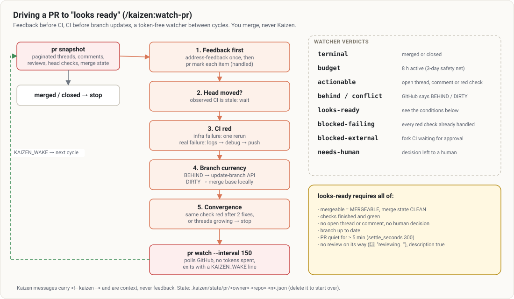

# `/kaizen:watch-pr`

> Drive an open PR to "looks ready to merge": feedback handled, CI repaired, branch up to date when
> GitHub asks for it. Then stop and let you merge.

## At a glance

| | |
|---|---|
| **What it does** | Successive cycles: review feedback **before** CI, repair of the head commit's CI, branch update on signal, waiting without tokens between two cycles |
| **When to use it** | After `/kaizen:ship`; "watch my PR"; "drive it to the merge" |
| **When not to use it** | A single comment (→ [address-feedback](address-feedback.md)); a single CI failure (→ [debug](debug.md)) |
| **What it produces** | Commits and replies on the PR, and a **true** final state: ✅ looks ready · 🟡 reservation · ⛔ blocked · ⏱️ budget · 🎉 merged · 🚫 closed · ⏸️ paused |
| **What next** | **You merge.** Kaizen never merges. |

## Examples

```text
/kaizen:watch-pr                 # PR of the current branch, watching up to 8 h
/kaizen:watch-pr 42 4h           # 4-hour budget
/kaizen:watch-pr 42 checkpoint   # a single cycle, then the resume command
```



In depth: [pull requests](../concepts/pull-requests.md#driving-the-pr-to-looks-ready).

## A cycle (imposed order)

A fresh `pr snapshot` (the only source of truth), then: PR finished → stop; **feedback before CI**
(`address-feedback`, each item marked so it is never handled twice); stale head → wait; CI (one rerun
for an infrastructure failure, otherwise `debug` and a fix — never a disabled test or an empty commit);
update from the base only when GitHub says `BEHIND` or `DIRTY`; stop fixing blindly when the same check
stays red after 2 fixes. Details: [one cycle](../concepts/pull-requests.md#one-cycle).

## Waiting without spending

Between two cycles, `node $K pr watch --pr 42` polls GitHub in the background **without consuming
tokens**, and wakes Claude when there is something to do. Verdicts:
[waiting without spending](../concepts/pull-requests.md#waiting-without-spending).

## When does it say "looks ready"?

Mergeable and clean, checks green, nothing pending, no human decision outstanding, branch up to date,
and the PR quiet for at least 5 minutes. Before announcing it, it waits for a review still on its way
and checks the description is still true. It **never** says "safe to merge". Conditions:
[before saying "looks ready"](../concepts/pull-requests.md#before-saying-looks-ready).

## Good to know

- `blocked-external` (a fork PR's CI waiting for approval): Kaizen never approves.
- Budget: 8 h of active watching by default, 3-day safety net.
- Local state: `.kaizen/state/pr/<owner>-<repo>-<n>.json`. Deleting it starts over.
- A CI fix of more than `review.max_unreviewed_lines` lines (80) since the last review is refused at
  push time: `watch-pr` then reruns `/kaizen:review` before pushing.
- Prerequisite: an authenticated `gh`. Replies carry the `<!-- kaizen -->` marker.

## See also

[ship](ship.md) · [address-feedback](address-feedback.md) · [debug](debug.md) · [Troubleshooting](../troubleshooting.md#watch-pr-goes-round-in-circles-or-never-says-ready)
