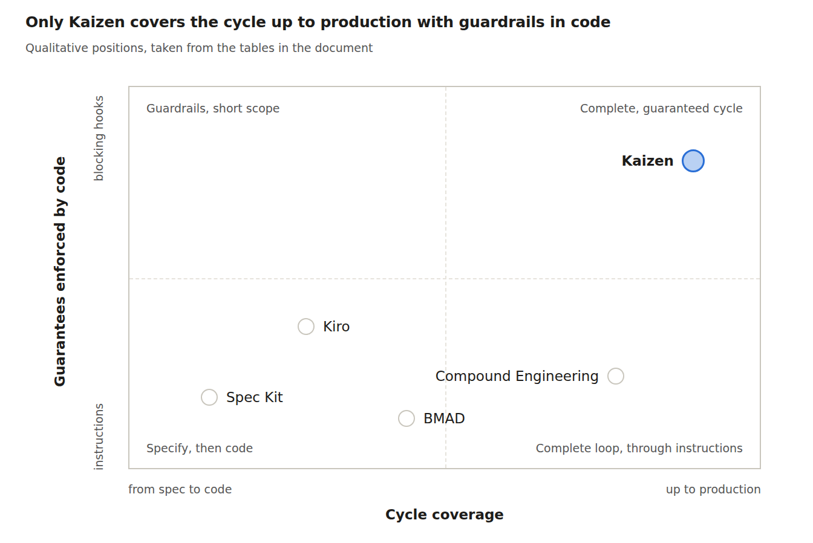

# Kaizen — SDLC assessment and positioning

*As of October 7, 2026, version 3.2.1.*

Kaizen is a complete SDLC tooled for an AI agent. It covers the idea, the plan, the code, the review,
the delivery, the watched deployment and the learning, with guardrails enforced by code. It is not a
team method.

## Cycle coverage

Every phase is covered. But only four are guarded by code; the others still partly rely on the
instruction given to the agent.

| Phase | What Kaizen does | Guaranteed by code |
| --- | --- | --- |
| Framing, requirements | constitution, `brainstorm` (R requirements, AE acceptance examples), `decide` (ADR) | partly: `plan check`, amendment approval |
| Design | `plan` (threats, rollout, PR slices), `doc-review` | partly: `plan check` (traceability, rollback, thresholds) |
| Implementation | `work`, `debug`, `polish` | yes: a hook blocks the end of the work on red tests |
| Verification | `review`, CI driven by `watch-pr` | yes: push refused without a review that really happened |
| Delivery | `ship`, `release` | yes: PR size measured, SemVer checked |
| Deployment | `deploy` (detected platform, rollback) | yes: code typed by the user for production, tags |
| Operations | `monitor` (plan thresholds, scheduled check, alerts), dated incidents, rollback | partly: continuous detection if `patrol` is scheduled or alerts are wired |
| Improvement | `learn`, `postmortem`, `metrics` (real DORA, cost) | partly: local measurement |

## How it is tested

Every script, hook and gate is covered by the test suite (`node --test plugins/kaizen/tests/*.test.mjs`:
unit, CLI, gates, PR flow against a fake `gh`, documentation contracts), run in CI on Linux, macOS and
Windows. 29 end-to-end evaluations drive the skills through a real `claude -p` session
(`node plugins/kaizen/evals/run.mjs`), from setup to deployment, rollback and postmortem.

## Limits

Four precise limits, to know before adopting it.

- **Not a team method.** No ceremonies, no estimation, no portfolio planning, no cross-team
  coordination.
- **Not an observability platform.** Kaizen neither collects nor stores metrics and does no on-call:
  it reads your signals and receives your alerts. Beyond the post-deployment window, continuous
  detection relies on a scheduled check (`monitor patrol`) or on your alerts wired to `monitor alert`;
  without either, a late incident only surfaces through `/kaizen:monitor`.
- **Guardrails against forgetfulness, not against a malicious agent.** An intermediate script is enough
  to bypass them.
- **Claude Code only.** The guarantees rest on Claude Code's hooks; another agent gets the skills'
  instructions, not the gates.

## Compared with classic SDLCs

Kaizen replaces none of them: it tools their practices inside the code repository. It is closest to
DevOps informed by DORA, applied to an AI agent's work.

| Reference | What Kaizen takes from it | What stays outside Kaizen |
| --- | --- | --- |
| Agile / Scrum | small increments, acceptance criteria, retrospective through the postmortem | sprints, backlog, roles, ceremonies |
| DevOps / DORA | small batches, CI, review, frequent deployment, the 4 metrics measured on real deployments | CI/CD platform, continuous observability, on-call |
| Secure SDLC (NIST SSDF, Microsoft SDL) | STRIDE threats in the plan, security reviewers, dependency audit, secrets | in-depth threat modeling, penetration testing, compliance evidence |
| Lean / Kaizen | continuous improvement, ceremony proportional to stakes (profiles), measured cost | flow management at organization scale |

## Compared with AI-assisted SDLCs

Kaizen is the only one of the five covering deployment and monitoring. In return, it only runs on
Claude Code.

| Criterion | [Spec Kit](https://github.com/github/spec-kit) (GitHub) | Kiro (AWS) | BMAD | [Compound Engineering](https://github.com/EveryInc/compound-engineering-plugin) (Every) | Kaizen |
| --- | --- | --- | --- | --- | --- |
| Shape | toolkit, commands | IDE (VS Code fork) | role-based method | plugin, 36 skills | plugin, 23 skills |
| Strength | spec → plan → tasks, constitution | specs, project rules, IDE hooks | personas (analyst, PM, architect, QA), detailed stories | learning loop, adoption, portability | guarantees enforced by code, from repo to production |
| Code review | through the convergence step | no (hooks) | QA agent | multi-agent | multi-agent, enforced and proven |
| Deployment, monitoring | no | no | no | no | yes |
| Learning loop | no | project rules (manual) | no | yes, its core | yes, taken from Compound |
| Supported agents | Copilot by default, extensible | Kiro only | several | 14 environments | Claude Code only |

## Positioning

*Qualitative positions, taken from the tables above* (source: [media/source/positioning.html](media/source/positioning.html)).
Compound Engineering covers the whole development loop, but through instructions. Kaizen adds
production and blocking guardrails, at the cost of portability.

## Compound Engineering: its strengths

Kaizen is derived from it under the MIT license: the loop, the artifact contracts, the learnings
schema, the reviewers and the packs come from Compound Engineering. On five points, Compound
Engineering does better.

1. **Wider adoption.** Used daily at Every, about 25,000 stars and 1,400 commits, a community and
   feedback from many teams. Kaizen is younger and has a much smaller user base.
2. **Portable.** 14 agent environments: Claude Code, Codex, Cursor, Copilot, Cline, OpenCode… Kaizen
   depends on Claude Code's hooks.
3. **Simpler to adopt.** A short loop (`/ce-brainstorm` → `/ce-plan` → `/ce-work` → `/ce-code-review` →
   `/ce-compound`), little configuration, nothing blocking.
4. **Wider catalog** around the loop: explanation, taking a position, design, collaboration, git.
5. **Maintained by several people**, with an international community.

What Kaizen adds, and what it costs:

| Kaizen's contribution | Cost |
| --- | --- |
| Guarantees enforced by code: green tests before the end of the work, push only after a proven review, production only with your code | more friction; Claude Code only |
| The second half of the SDLC: platform-aware deployment, rollback, monitoring, measured DORA | platform detection through heuristics, to validate project by project |
| Governance: constitution with checks and approvers, maturity audit, model per agent role, measured cost | more concepts to learn (the `lean` profile lightens it on low-stakes repos) |
| — | a single maintainer |

## Recommendation

Compound Engineering is the best learning loop for an agent, widely adopted and portable. Kaizen is a
more complete and better controlled SDLC, but younger and tied to Claude Code.

- **Choose Compound Engineering** for a multi-tool team, or one that wants to start light.
- **Choose Kaizen** for a team on Claude Code that wants quality guarantees up to production.
- **Pick the profile by stakes, not by team experience:** `lean` for a prototype or internal tool,
  `standard` for a product in production, `full` for regulated or critical domains. Then measure the
  effect with `/kaizen:metrics` (real DORA, cycle cost, learnings applied).

## Sources

- [Compound Engineering — EveryInc](https://github.com/EveryInc/compound-engineering-plugin)
- [GitHub Spec Kit](https://github.com/github/spec-kit)
- [Kiro — hooks documentation](https://kiro.dev/docs/hooks/)
- [InfoQ — Kiro, a spec-driven agentic IDE](https://www.infoq.com/news/2025/08/aws-kiro-spec-driven-agent/)
- [Comparative guide to Kiro, Spec Kit, BMAD](https://medium.com/@visrow/comprehensive-guide-to-spec-driven-development-kiro-github-spec-kit-and-bmad-method-5d28ff61b9b1)
- [BMAD Method — guide](https://www.augmentcode.com/guides/bmad-method-ai-development)
