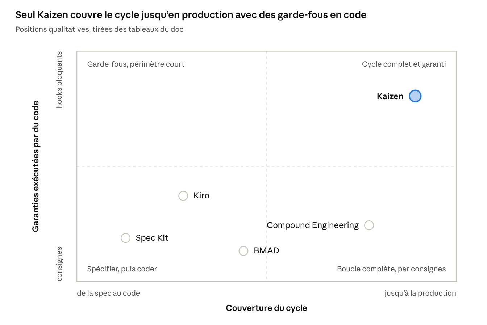

# Kaizen — bilan SDLC et positionnement

*Au 4 octobre 2026, version 2.1.0.*

Kaizen est un SDLC complet outillé pour un agent IA. Il couvre l'idée, le plan, le code, la revue, la
livraison, le déploiement surveillé et l'apprentissage, avec des garde-fous exécutés par du code. Ce
n'est pas une méthode d'équipe, et il n'a pas encore fait ses preuves sur un vrai projet.

## Couverture du cycle

Toutes les phases sont couvertes. Mais seules quatre sont gardées par du code ; les autres reposent
encore en partie sur la consigne donnée à l'agent.

| Phase | Ce que fait Kaizen | Garanti par du code |
| --- | --- | --- |
| Cadrage, exigences | constitution, `brainstorm` (exigences R, exemples d'acceptation AE), `decide` (ADR) | en partie : `plan check`, approbation des amendements |
| Conception | `plan` (menaces, déploiement, tranches de PR), `doc-review` | en partie : `plan check` (traçabilité, retour arrière, seuils) |
| Implémentation | `work`, `debug`, `polish` | oui : hook qui bloque la fin du travail sur des tests rouges |
| Vérification | `review`, CI menée par `watch-pr` | oui : push refusé sans revue réellement faite |
| Livraison | `ship`, `release` | oui : taille des PR mesurée, SemVer vérifié |
| Déploiement | `deploy` (plateforme détectée, retour arrière) | oui : code tapé par l'utilisateur pour la production, tags |
| Exploitation | `monitor` (seuils des plans, contrôle planifié, alertes), incidents datés, retour arrière | en partie : détection continue si `patrol` est planifié ou les alertes branchées |
| Amélioration | `learn`, `postmortem`, `metrics` (DORA réel, coût) | en partie : mesure locale |

## Limites

Quatre limites précises, à connaître avant de l'adopter.

- **Pas une méthode d'équipe.** Pas de cérémonies, pas d'estimation, pas de planification de
  portefeuille, pas de coordination entre équipes.
- **Pas de plateforme d'observabilité.** Kaizen ne collecte ni ne stocke de métriques et ne fait pas
  d'astreinte : il lit vos signaux et reçoit vos alertes. Au-delà de la fenêtre après déploiement, la
  détection continue repose sur un contrôle planifié (`monitor patrol`) ou sur vos alertes branchées à
  `monitor alert` ; sans l'un ou l'autre, un incident tardif ne remonte que par `/kaizen:monitor`.
- **Des garde-fous contre l'oubli, pas contre un agent malveillant.** Un script intermédiaire suffit
  à les contourner.
- **Pas encore éprouvé en conditions réelles.** Les 29 évaluations de bout en bout tournent sur des
  projets de démonstration, pas en équipe sur la durée.

## Face aux SDLC classiques

Kaizen n'en remplace aucun : il outille leurs pratiques dans le dépôt de code. Il est le plus proche
de DevOps éclairé par DORA, appliqué au travail d'un agent IA.

| Référence | Ce que Kaizen en reprend | Ce qui reste hors de Kaizen |
| --- | --- | --- |
| Agile / Scrum | petits incréments, critères d'acceptation, rétrospective par le post-mortem | sprints, backlog, rôles, cérémonies |
| DevOps / DORA | petits lots, CI, revue, déploiement fréquent, les 4 indicateurs mesurés sur les vrais déploiements | plateforme CI/CD, observabilité continue, astreinte |
| SDLC sécurisé (NIST SSDF, Microsoft SDL) | menaces STRIDE dans le plan, relecteurs sécurité, audit des dépendances, secrets | modélisation de menaces approfondie, tests d'intrusion, preuves de conformité |
| Lean / Kaizen | amélioration continue, adoption progressive (profil `lean`), coût mesuré | gestion du flux à l'échelle de l'organisation |

## Face aux SDLC assistés par IA

Kaizen est le seul des cinq à couvrir le déploiement et le monitoring. En contrepartie, il ne tourne
que sur Claude Code.

| Critère | [Spec Kit](https://github.com/github/spec-kit) (GitHub) | Kiro (AWS) | BMAD | [Compound Engineering](https://github.com/EveryInc/compound-engineering-plugin) (Every) | Kaizen |
| --- | --- | --- | --- | --- | --- |
| Forme | boîte à outils, commandes | IDE (fork de VS Code) | méthode à rôles | plugin, 36 skills | plugin, 23 skills |
| Point fort | spec → plan → tâches, constitution | specs, règles projet, hooks d'IDE | personas (analyste, PM, architecte, QA), stories détaillées | boucle d'apprentissage, adoption, portabilité | garanties par du code, du dépôt à la production |
| Revue de code | via l'étape de convergence | non (hooks) | agent QA | multi-agents | multi-agents, imposée et prouvée |
| Déploiement, monitoring | non | non | non | non | oui |
| Boucle d'apprentissage | non | règles projet (manuelles) | non | oui, son cœur | oui, reprise de Compound |
| Agents pris en charge | Copilot par défaut, extensible | Kiro seulement | plusieurs | 14 environnements | Claude Code seulement |

## Positionnement

*Positions qualitatives, tirées des tableaux ci-dessus.* Compound Engineering couvre toute la boucle
de développement, mais par des consignes. Kaizen ajoute la production et des garde-fous bloquants, au
prix de la portabilité.

## Compound Engineering : ses forces

Kaizen en est dérivé sous licence MIT : la boucle, les contrats d'artefacts, le schéma des leçons,
les relecteurs et les packs viennent de Compound Engineering. Sur cinq points, Compound Engineering
fait mieux.

1. **Éprouvé.** Utilisé au quotidien chez Every, environ 25 000 étoiles et 1 400 commits, une
   communauté et des retours réels. Kaizen n'a que des évaluations synthétiques.
2. **Portable.** 14 environnements d'agents : Claude Code, Codex, Cursor, Copilot, Cline, OpenCode…
   Kaizen dépend des hooks de Claude Code.
3. **Plus simple à adopter.** Une boucle courte (`/ce-brainstorm` → `/ce-plan` → `/ce-work` →
   `/ce-code-review` → `/ce-compound`), peu de configuration, rien de bloquant.
4. **Catalogue plus large** autour de la boucle : explication, prise de position, design,
   collaboration, git.
5. **International et maintenu à plusieurs**, en anglais.

Ce que Kaizen ajoute, et ce que ça coûte :

| Apport de Kaizen | Coût |
| --- | --- |
| Garanties exécutées par du code : tests verts avant la fin du travail, push seulement après une revue prouvée, production seulement avec votre code | plus de friction ; Claude Code seulement |
| Seconde moitié du SDLC : déploiement adapté à la plateforme, retour arrière, monitoring, DORA mesuré | détection de plateforme par heuristiques, à valider projet par projet |
| Gouvernance : constitution avec contrôles et approbateurs, audit de maturité, modèle par rôle d'agent, coût mesuré | plus de concepts à apprendre (le profil `lean` atténue) |
| — | un seul mainteneur, documentation en français seulement |

## Recommandation

Compound Engineering est la meilleure boucle d'apprentissage pour un agent, éprouvée et portable.
Kaizen est un SDLC plus complet et mieux contrôlé, mais plus jeune et lié à Claude Code.

- **Choisir Compound Engineering** pour une équipe multi-outils, ou qui veut démarrer léger.
- **Choisir Kaizen** pour une équipe sur Claude Code qui veut des garanties de qualité jusqu'en
  production.
- **Prochaine étape pour Kaizen :** le valider sur un vrai projet pendant quelques semaines, en
  profil `lean`, et en mesurer l'effet avec `/kaizen:metrics` (DORA réel, coût des cycles, leçons
  appliquées).

## Sources

- [Compound Engineering — EveryInc](https://github.com/EveryInc/compound-engineering-plugin)
- [GitHub Spec Kit](https://github.com/github/spec-kit)
- [Kiro — documentation des hooks](https://kiro.dev/docs/hooks/)
- [InfoQ — Kiro, IDE agentique piloté par les specs](https://www.infoq.com/news/2025/08/aws-kiro-spec-driven-agent/)
- [Guide comparatif Kiro, Spec Kit, BMAD](https://medium.com/@visrow/comprehensive-guide-to-spec-driven-development-kiro-github-spec-kit-and-bmad-method-5d28ff61b9b1)
- [BMAD Method — guide](https://www.augmentcode.com/guides/bmad-method-ai-development)
